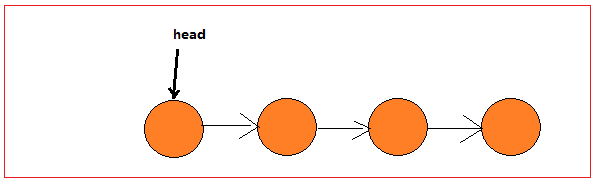
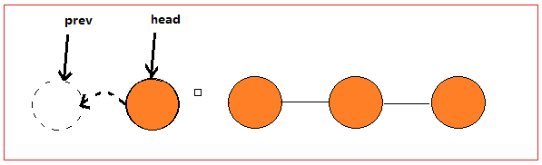
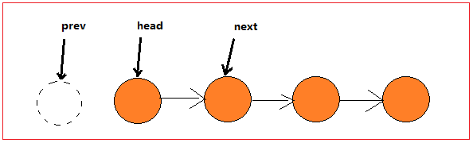
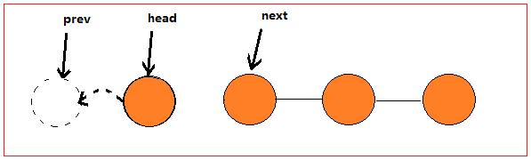
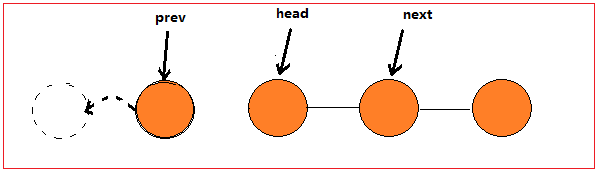

### LeetCode-206 反转单链表

> 给你单链表的头结点 head，请你反转链表，并返回反转后的链表。

问题分析：

这是初始状态的链表

<center>
    
</center>
由于反转链表后 **head** 结点将指向空（null），我们可以假设存在这么一个为空的结点prev。  

尝试一次反转后，我们发现，后续结点信息丢失了！我们不得不声明一个新的变量保存原链表的信息。

<center>
    
</center>

所以，我们一共需要三个指针来记录转换过程  
+ prev、 head 用于交换
+ next 用于记录  

分析到这里，我们再回到初始状态  ：

<center>
    
</center>

接下来我们进行第一次反转，**head.next** 指向虚拟的空结点，且后续链表信息没有丢失。

<center>
    
</center>

三个指针一起往后移动一个单位。我们发现此时链表又回到了最初的状态。

<center>
    
</center>


至此，我们可以尝试写出如下代码：

```java
public static ListNode reverseIteratively(ListNode head) {
    ListNode pre = null;
    ListNode next = null;

    while (head != null) {
        next = head.next;

        //改变指针方向，对第一个节点来说，他的前一个节点是null
        head.next = pre;
        //向前移动两个指针
        pre = head;
        head = next;
    }
    return pre;
}
```


思考：
你能使用递归的方式改写上述代码逻辑吗？


