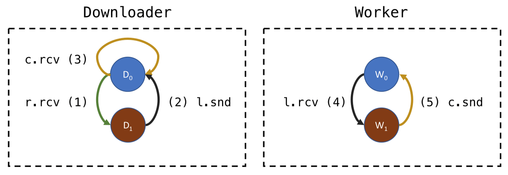
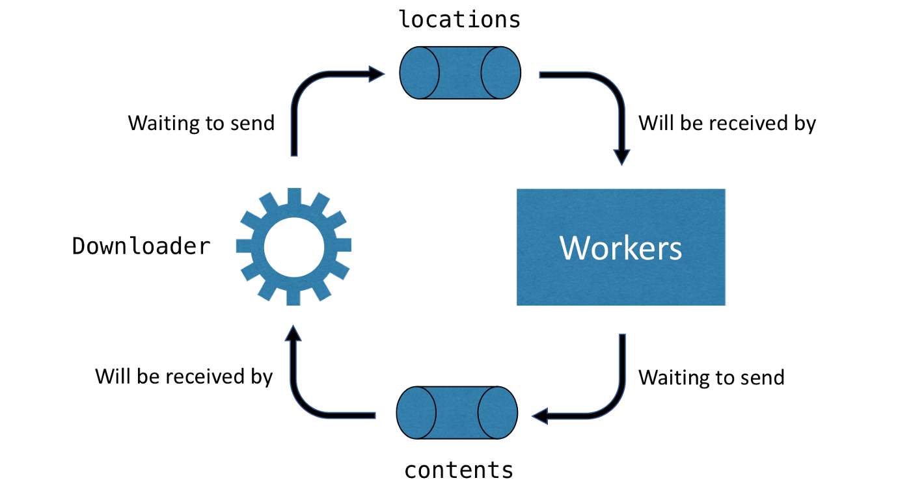

#### 简介：
本文是 Roman Elizarov 关于CSP中产生死锁问题的讨论，解释了其中的原因，并逐步给出了一种解决方案。部分翻译不恰当的可参考[原文](https://elizarov.medium.com/deadlocks-in-non-hierarchical-csp-e5910d137cc)


#### 原文：
众所周知，使用锁保护共享可变状态可能会导致死锁，但很少有人知道，使用无共享可变状态的CSP或actor模型也会导致死锁，尽管它们并不使用锁。它的死锁以另一种方式表现：通信死锁。

要知道，死锁的正式定义并没有直接与锁联系在一起。当每个进程都在循环等待下一个进程时，这组进程(线程/协程/参与者)就处于死锁状态。后面我们会看个例子，这里先道个歉，之前没强调这个问题。

#### The stage

在2018年的KotlinConf我发表了题为"Kotlin协程实践"的演讲，其中讲到了对于构建可信赖软件来说结构性并发是重要的，且介绍了CSP的一些高级概念。其中一个部分有点问题。如果你按照演讲中一字不差的写完代码会导致一个死锁。不知何故，我掉进了这个陷阱，以为它对我来说是安全的，但不是。让我们来分析一下

首先来讲，如果应用被组织成数据处理管道，消息进入系统，被不同的协程顺序处理，最后被送出系统，那么这种CSP风格的架构，包括actor模式，都是安全的。更广泛地说，只要代码具有协程的层次结构(或有向无环图)，上游协程只向下游发送消息，且每个协程在同一个地方接收传过来的消息并向下游传递响应消息，代码就不会出现死锁。

<center>
    
</center>


然而在我的演讲中，我草拟了一个数据处理循环的架构，下载器协程向任务池发送`locations`，并从任务池获取结果：

<center>
    
</center>

我演讲中的例子的架构基于3个channel：`references`、`locations`、`contents`。下载协程包含以下逻辑：
```kotlin
while (true) {
    select<Unit> {                                   
        references.onReceive { ref ->                // (1)
            val loc = ref.resolveLocation()
            ... 
            locations.send(loc)                      // (2)
        }
        contents.onReceive { (loc, content) -> ... } // (3)
    }
}
```
Downloader从`references`通道(1)接收，解析对位置的引用并将它们发送到`locations`通道(2)。它还通过从`contents`通道(3)接收来自workers的结果来更新其状态。另外，works有以下代码:

```kotlin
for (loc in locations) {                             // (4)
    val content = downloadContent(loc)         
    contents.send(LocContent(loc, content))          // (5)
}
```

从`locations`通道接收消息（4），并发送下载后的内容去`contents`通道（5）


即使在两段通信的代码中也很难遵循逻辑，但在CSP中有一种方便的方法来可视化它。我们可以用通信有限状态机(CFSM)表示我们的系统。这些状态相当于挂起点和向通信的转变过程:

<center>
    
</center>

为了简洁起见，上图中通道名简写。receive -> rcv、send -> snd 。下载器主循环中的`select`语句相当于D0状态，它能接收来自`references`通道的消息(1)或者来自`contents`通道的消息(3)，当接收到来自`references`消息，切换到状态D1，等待发送消息去`locations`通道，如图中：(2)l.snd


#### Deadlock [Demo](https://github.com/elizarov/DeadlocksInCSP)

我用模拟数据类的方式完善了演讲中的代码，加入了`delay(10)`的`downloadContent`方法。main函数则持续发送请求给下载器的`references`通道，它有4个workers且带3秒超时限制。此项目可以完整的运行,正常情况下3s应该处理1000次请求。


当你运行该项目时，你会发现只处理了4次请求（和我们定义的worker数量一样）就挂起了，直到3s超时。此外，它没有任何随机性，因为它是在单线程的runBlocking上下文中运行的。

为了说服你（还有我自己），这是CSP内在的行为而不是Kotlin实现的bug，我用Go语言实现了一遍。Go语言内建的死锁检测器立即给出了提示：_all goroutines are asleep — deadlock_ ，到底发生了什么呢？


开始时所有的worker完成初始化处于W1状态，然后尝试发送回复下载器的消息去`contents`通道(5)，但它是一个对接通道，下载器不能立马收到。下载器处于D1正尝试发送消息去`locations`通道(2)，但由于worker都在尝试发送所以无法接收。死锁发生了，所有的协程都在等待。


<center>
    
</center>

#### Solutions that do not work

问题好像出在`select`表达式。修复它很简单。相对于由下载器通过select处理来自`references`和`contents`的消息，我们可以使用actor模型作为协程重写下载器，它有独立的mailbox通道来处理发送过来的消息。

```kotlin
for (msg in mailbox) {
    when (msg) {
        is Reference -> ...
        is LocContent -> ...
    }
}
```

然而，actor模型也不能避免死锁，这种方式和原来一样代码很快被挂起。他们的通讯状态机是相同的。

另一个可能被指责的是集合信道——没有缓冲区的信道，因为它们在另一端没有接收器的情况下会暂停发送。即使我们给`contents`和`locations`添加buffer也不能解决此问题，只是减少了问题出现的概率或延迟出现。buffer越大出现的概率越低，但无法完全避免死锁的发生，一旦buffer满了发送器还是会挂起并发生死锁。

#### Unlimited-capacity channels

一种明确的避免死锁的解决方案是对被通讯死锁影响的channel中的至少一个使用不限大小的buffer，[这里](https://github.com/elizarov/DeadlocksInCSP/blob/master/src/DownloaderWithUnlimitedBuffer.kt#L49) 的代码对`contents`通道使用了无限制buffer，似乎能正常工作。

然而，通过取消通道缓冲区的限制，我们丧失了CPS编程风格的利润丰厚的属性-自动背压传播.如果来自通道的消息的接收方比发送方慢，则发送方将挂起在全缓冲区上以自动减慢速度。有了无限容量的通道，就不会发生这种情况，管理背压的任务完全由应用程序开发人员承担。如果不能管理背压，系统最终可能会耗尽内存，在其缓冲区中收集越来越多的消息。

在我们的例子中，把`locations`通道设置成无限buffer会完全移除对传入引用的背压管理，因为即使所有的worker都处于忙碌状态，下载器也将发送所有的消息去`locations`通道。
把contents通道设置成无限buffer会更安全，因为它只影响下载内容的最终处理。然而，在无限容量的情况下，我们面临的风险是，下载器会被传入的`references`淹没，永远无法处理下载的内容。这使我们离最终解决方案更近一步。


#### Solutions that do work

我们调整一下下载器协程中`select`表达式的顺序，以便先检查`contents`通道，也就是说`contents`通道的消息优先级高于`references`通道：

```kotlin
select<Unit> {
    contents.onReceive { ... }
    references.onReceive { 
        ... 
        locations.send(loc)                      // (2)
    }
}

```

它本身并没有解决这个问题(你可以在这里验证代码),但它给了一个有用的属性——
下载器只有在没有worker被挂起且worker准备发送消息去`contents`通道时，才发送消息去`locations`通道(2)。现在，提供至少一个buffer给`contents`通道就足够了，以确保至少有一个worker可以在(5)发送其内容，并在(4)再次开始从`locations`接收，从而允许下载程序继续进行:

```kotlin
val contents = Channel<LocContent>(1)
```

[这里](https://github.com/elizarov/DeadlocksInCSP/blob/master/src/DownloaderFixedPriority.kt) 是能运行的代码。

注意，它是如何在3秒内处理比之前的无限渠道“解决方案”更多的下载的。此外，由于`contents`通道处理具有最高优先级，现在可以安全地拥有无限容量的`contents`通道。它在缓冲区中保存的消息永远不会超过工作人员的数量加1(为什么是加1 ?这是留给读者的练习)。

还有一种替代解决方案，它完全不使用缓冲通道，可以完美地与任何容量的通道一起工作。它加倍`select`，以避免在`locations.send(loc)`上挂起下载程序，将这个发送操作折叠为一个`select`。它实际上是CFSM模型中表示和分析的最简单的一个，但是我现在不会详细介绍它，把它留给将来的故事。你可以看一下[这里](https://github.com/elizarov/DeadlocksInCSP/blob/master/src/DownloaderFixedSelect.kt#L16) 对应的代码并在playground中运行它。


#### 总结

通信循环(非DAG模式)可能并将导致通道容量有限的通信死锁，除非使用一些死锁预防策略。如果在应用程序中遇到死锁，在了解发生了什么之前，不要尝试使用缓冲通道解决它，否则可能会把问题掩盖起来。

请在本文的评论中分享更多解决这种特殊通信循环死锁的有效解决方案。Kotlin和其他CSP/actor运行时中的代码都是受欢迎的(请提供链接，不要将代码粘贴到评论中)。


#### Credits
我要感谢Alexey Semin，他通过[这个](https://github.com/Kotlin/kotlinx.coroutines/issues/797) github-issue报告了这个问题，并感谢Alexander Gorynin在Kotlin Slack里联系了我。还要感谢Simon Wirtz和Sean McQuillan对本文草稿的有用评论。
