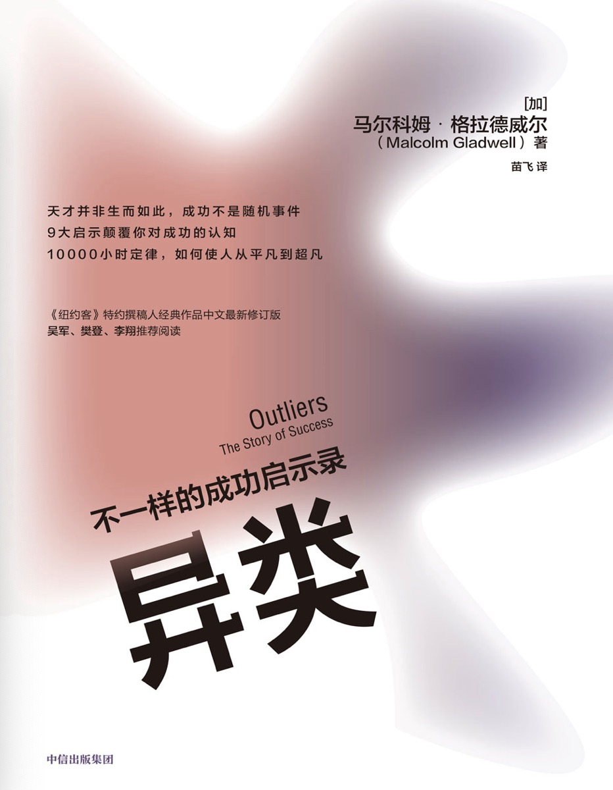

#### 概述
###### 书籍简介
<table>
    <tr>
        <td></td>
        <td>异类：不一样的成功启示录</td>
    </tr>
</table>

###### 关于作者
马尔科姆·格拉德威尔（Malcolm Gladwell）（1963年9月3日）毕业于多伦多大学的三一学院，主修历史学，是一位加拿大作家、记者和演讲者，以其畅销书和在《纽约客》杂志上的文章而闻名。他的作品通常探讨社会科学、心理学和行为经济学的主题，通过生动的故事和深刻的见解启发读者。

其他出版物：
《引爆点》（The Tipping Point, 2000）：探讨了如何通过少数关键因素引发大的变化，书中引入了“引爆点”的概念。
《决断两秒间》（Blink, 2005）：研究了人们在瞬间决策中的潜意识过程和直觉判断。
《异类》（Outliers, 2008）：探讨了成功背后的非凡因素，提出了“1万小时定律”等概念。
《大开眼界》（What the Dog Saw, 2009）：这本书是他在《纽约客》杂志上发表的文章的集合，涵盖了各种主题。
《大卫与歌利亚》（David and Goliath, 2013）：讨论了在人们认为不利的条件下如何取得成功。
《谈话的力量》（Talking to Strangers, 2019）：探讨了人们在与陌生人交流时常犯的错误及其后果

#### 第一部分：机遇

##### 马太效应：英超球员的优势积累
这一节分成六个部分：
+ 成功靠什么：成功靠的是个人意愿和能力优势，只能靠自己而不是他人的帮助。**真的是这样吗？**
+ 成功者之幸
+ 生于年初：职业青年队绝大多 数球员的生日集中在1月、2月和3月
+ 优势积累：一个1月1日出生的选手，是在跟许多年纪比其小的队友争夺晋级权。晋级后接受更好的训练。
+ 我们要做怎样的改变：制度改革。
  + 领先优势造就了天才们辉煌的成就。
  + 在社会学领域，所谓的成功就是“优势积累”的结果
  + 很多制度甚至过早地将一部分人划入了失败者的行列，阻碍了这些人成才
+ 离绝对老大只剩三天：出生在1月4日，只差3天他就是同龄队员中绝对的老大了

读书笔记：**有意识的提前建立优势，并不断积累优势是成功的关键。**

##### 1万小时定律：生于1955年的乔布斯和比尔盖茨
这一节分成六个部分：
+ 天才创始人：计算机科学家比尔·乔伊。
+ 一万小时有多久：一万小时训练是成为优秀的必要条件。
+ 安娜堡计算机中心的日日夜夜：
>现在， 让我们理一理比尔·乔伊的机遇链吧。 
> 他有幸考入作为计算机学 科领跑者的密歇根大学；
> 有幸第一批使用分时系统，而不是键盘打孔机；
> 又恰巧密歇根大学的机房管理系统有漏洞， 他得以想学多长时间就学多长时间；
> 因为计算机中心24小时开放，他又得以夜以继日地学习；
> 他获得了充分的时间练习编程，所以当改造UNI;系统项目开始的时候，他顺理成章地进入了项目组。
> 比尔·乔伊的确聪明绝顶，他也热爱学习，这是他成功的一大因素。
> 但是，在他成为专家以前，他首先依靠运气获得了成为专家的机会。
+ 甲壳虫乐队的汉堡之行:正是在汉堡的超量训练才使甲壳虫乐队脱颖而出的。
+ 1968年的电脑:比尔盖茨的机遇和更多使用电脑的机会。
+ 时势造成功：机遇造就了成功。

读书笔记：成功 = 时代机遇 + 努力

##### 智商和机遇：曼特人的谬误
这一节分成五个部分：
+ 全美最聪明的人：智商195的兰根参加《以一敌百》节目。
+ 超常“特曼人”
> 这些被挑选出来的天才少年，正式成为历史上最著名的心理学研究的研究对象，他们被统称为“特曼 人”。
+ 智商的门槛效应
> 智商与成功只在一定程度上相互关联， 一旦某 人的智商超过120分，此时更高的智商并不意味着会同比转化成更多的现实优
+ 充满想象力的心灵:发散性思维测试要求你运用想象力，寻找尽量多的不同的可能性。
+ 事与愿违的试验结果:特曼忽略了一个事实——智力在现实中的作用并 没有那么大。

##### 社交与家庭：天才兰根的忧伤

这一节分成六个部分：
+ 令人心碎的天才命运：天才兰根家庭环境不好，即使是天才，最后结局也很一般。
+ 另一位天才的命运：天才奥本海默，家庭环境好，结局成功。
+ 实践智力从哪来：两个天才的结局为何如此不同？实践智力不同！
+ 协同培养的典范：奥本海默是协同培养的典范。
+ 协同培养与自然成长
+ 如何避免悲剧重演

> 家境富裕的父母总是让孩子一刻也不能闲着， 让孩子穿梭于各项活动之 间，并听取孩子对老师、教练或是队友的评价
> 而穷人家孩子的生活中完全没有这种紧张的时间安排， 他们的活动不会 是每周两次足球训练，而是和亲戚或者邻居家的孩子在外面玩耍。

读书笔记：家庭教育很重要，让孩子高效利用时间深度参与到有意义的社会活动中，鼓励孩子表达自己的想法，挑战权威，敢于表现自己。

##### 最佳时代：乔-弗洛姆的律师生涯

这一节分为七个部分：
+ 律师事务所之翘楚：贫穷的移民，被歧视的犹太人：乔-弗洛姆，从世达律师事务所的助理到合伙人，从几个人到几千人。**这是时代造就了行业**。
+ 纽约移民区的故事：弗洛姆成长环境下的几个小故事。
  + 启示一：身为犹太人的重要性：
在那个年代，如果你的家庭背景、宗教信仰、社会地位不符合要 求， 即便你是从法学院毕业的， 你也只能去那些二流的、 刚起步的小事务所，或者自己创业。
  + 启示二：生育潮低谷之幸
受20世纪30年代的经济大萧条和第二次世界大战（1939—1945年）的影响，不同阶段出生的人的命运截然不同。
  + 启示三：服装厂与有意义的工作
路易斯·波吉尼特和瑞吉娜·波吉尼特夫妇移民美国后卖围裙成长起来的故事。
+ 一代新人胜旧人
+ 成功不是随机事件

读书笔记：受歧视的乔-弗洛姆进不了大公司只能进小公司，自己创业，处理那些别人不愿处理的案子。随着时代或政策的转变业务激增，二流律师摇身一变成为一流。弗洛姆并不 是克服了逆境，而是原先的逆境忽然之间变成了机遇。

#### 第二部分：文化传承

##### 文化差异：小镇哈伦

这一节分为四部分：
+ 血染哈伦
哈伦县城两大家族矛盾和枪战。
+ 荣誉文化
> “荣誉文化”植根于高地或富庶地区的边缘地带，如意大利的西西里岛 和西班牙的巴斯克山区。这种解释的逻辑是，当人们居住在多岩石的山坡地 带时，由于那里的土地很难耕种，人们大多会依靠放牧生活。游牧文明和耕 种文明大相径庭。 
> 从事耕种的农民要想维持生计依靠的是人与人之间的合 作，而从事游牧的牧民所依靠的更多的是自己。农民不必担心他们的庄稼一 夜之间就被人全部偷走，除非盗贼有本事一个晚上就把地里的所有庄稼收割 完。但是牧民就有这样的担忧。
> 实际上，他们一直生活在牲口被偷，整个生 活被毁的恐惧之下。所以他们养成了好斗的性情：他们必须通过自己的言行 表明自己不是弱者，要对危及他们名誉的哪怕是最轻微的挑战予以最坚决的 反击——这就是“荣誉文化”的含义。在游牧文化所在的地方，荣誉感往往是当地男性的存在感与自我价值的中心。
+ 遗泽百世
心理学家做实验，发现：
>有些人的回应被其之前遭到的侮辱影响，有些人的则没有。志愿者的行为是否改变，并不取决于他们的情绪是否稳定，也不取决于他们是知识分子还是运动员， 同样也不取决于他们的相貌。 这其中的决定性因素——我想你一定已经 猜到了——是他们来自何方。
+ 文化传承的力量
> 文化传承是事件背后更强大的力量， 它根深蒂固，影响长存。 经过数代 传承，即便塑造文化的经济、社会、人口等条件已经消失，这种文化也会一 直完好无损地留传下来。文化直接决定了我们看待世界的方法和行为模式，其作用如此巨大，以至于没有它，我们将无法认识世界。

##### 权力距离指数：韩国飞机失事率

> 权力距离是指人们对待比自己更高等级阶层的态度，特别是指对权威的重视和尊重的程度。

+ 大韩航空801航班：大韩航空空难的故事。
+ 祸不单行：大韩航空是如何从一家安全记录糟糕的公司转变成世界最好的航空公司之一的。
+ 阿维安卡航空052航班：燃油耗尽导致的空难。
+ 初探052航班坠毁：飞机本身操作难度大，机长多次误判，副机长缺乏和塔台的沟通
+ 成功化解空中危机的案例：老人机上晕厥，需要紧急降落，机长决策各种情况，和同事沟通最后完美降落。
> 这次降落要求拉特瓦特必须具备一定 的沟通素质。这里的沟通不仅意味着向机组下达降落指令，还意味着鼓励、 安抚、说服他人，与他人商讨，以及用清晰无误的语言与他人共享信息。
+ 再探052航班坠毁事件:沟通和表达存在问题。
> 那晚与052航班通过话的另一个航空管制员形容克洛茨“语调冷淡……声音中丝毫听不出紧急之意”。
+ 严禁客套：与缓和性语气做斗争， 成为过去15年间商业航空业的主要战役
+ 052航班的最后时刻：
+ 三探052航班坠毁：
+ 空难的深层原因：
  + 这次事故在很大程度上源于哥伦比亚人长久以来对权威的敬畏与服从
  + 副机长只把自己定位为下属，既然是下属关键性的决定就不应由自己做出，这个决定应由机长做出。
+ 不断积累的小问题:具备飞机失事的3个典型前提：轻微的技术故障、坏天气、疲惫的飞行员
+ 高权力距离指数之恶：(我觉得所谓的高权威，其实就是一种等级制度)
> 高权力距离指数文化的这种对话方式，只有在聆听者有条件揣摩 对方话语的情况下才是适宜的。也就是说，双方得有足够的时间相互揣摩。 这种方式绝不应该在暴风雨的夜晚，在精疲力竭的机长准备把飞机降落在一 个下滑角指示灯有故障的机场时使用。
+ 卸下重担：

读书笔记：客机失事的主要原因在于权利指数在副驾驶和主驾驶之间发挥着作用。这是一种文化特征，是一种上下级的阶级关系。我们应该对事不对人，客观辩证的处理问题，不屈服于权威。

##### 内在优势：亚洲人精神

这一节分为6个部分：
+ 数字优势：亚洲人在数字方面有优势，一方面是因为他们对数字的发音更短，另一方面得益于族裔文化。
+ 稻田中的辛劳：种植水稻的亚洲农民一年的工作时长约为3000小时。
+ 稻田精神：努力工作的精神品质在亚洲人身上很常见。
+ 斜率难题：一个计算直线的斜率的实验。
+ 怎样做才算是勤奋：态度比能力更重要。 只要你有意愿，你就能驾驭数学。
+ 劳有所得：哪个国家和地区的学 生更愿意花时间仔细回答冗长的问卷，哪个国家和地区的学生在TIMSS考试中的成绩就更好。

读书笔记：亚洲人精神:吃苦耐劳，耐心，持之以恒。

##### 扭转风气：玛丽塔之幸

这一节分为6个部分：
+ 风气之先：KIPP项目代表了美国教育的新理念，它的成功并非依靠环境、师资或制度创新。
+ 西方教育的传统：
  + 亚洲：水稻耕种次数越多收获越多 -> 学习越努力收获越多
  + 西方：小麦需要休耕让土地保持肥沃 -> 过度学习会对学生个性生活习惯造成恶劣影响
+ 成绩到底差在哪儿：假期时间导致低收入家庭孩子成绩没长进，而高收入家庭孩子在假期做的事情更有意义。
+ 对症下药：更多的学习时间，更慢的节奏，更多理解和思考。
+ 挑战自我：KIPP学园的学生(玛丽塔)：多出50%-60%的时间学习，早上5点就起床，很晚才睡。
+ 机遇之歌：玛丽塔需要的其实只有一样东西——机遇.(玛丽塔放弃一些自由时间，放弃一些个性，通过更多的学习时间和努力改变自己的命运，原本上不了大学，现在有机会了)
>“异类”是那些获得特殊机遇之人，是那些耐心等待，当机遇到来时就当仁不让地把握住的人。
> 对于加拿大的冰球运动 员来说，生于1月就是他们进入全明星队的机遇。
> 对于甲壳虫乐队来说，汉堡 之旅就是他们成名的机遇。
> 对于比尔·盖茨来说，他的特殊机遇就是生在正 确的年代，并在初中时代就获得电脑终端。
> 对于弗洛姆和沃切尔·利普顿· 罗森·卡茨律师行的创始人来说，机遇是多重的：他们出生于最佳年代，有着能给他们最勤勉激励的父母；他们拥有少数族裔身份，这种身份帮助他们在纽约其他传统律师事务所涉足公司并购官司以前，就已在这个领域实践了20年。
> 最后是大韩航空，直到公司帮助飞行员突破原有文化的禁锢，他们才最终扭转了局势。

