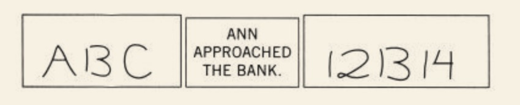

本章包含三节：

+ 是什么让你相信了那些荒谬之辞
+ 光环效应与群体智慧
+ 眼见为实的想法往往让我们仓促作出决定

#### 开篇

    

> “同样的形状在字母的环境下就容易被看做是字母，在数字的环境下就容易被看做是数字”

> “你过早地对它的“身份”下了结论，并且根本意识不到你已经赋予了某种歧义以解释。”

> “你作了一个确切的选择，但自己却没有意识到自己这样做了”

#### 是什么让你相信了那些荒谬之辞

> 联想记忆的运作是导致“确认偏误”的原因之一

“你试试他给出的例子：“白鱼吃糖果。”
你有可能意识到一个关于鱼和糖果的模糊印象，这个印象的产生过程，就是联想记忆自动搜索“鱼”和“糖果”这两个概念之间各种联系的过程，这一过程会使这种很荒唐的说法看起来竟有些道理了。

#### 光环效应与群体智慧

“如果你赞同一个总统的政见，你可能也会喜爱他的声音及着装。喜爱（或讨厌）某个人就会喜爱（或讨厌）这个人的全部—包括你还没有观察到的方面—这种倾向就叫做光环效应”

Alan：聪明—勤奋—冲动—爱挑剔—固执—忌妒心强
Ben：忌妒心强—固执—爱挑剔—冲动—勤奋—聪明

“光环效应注重第一印象，而后续信息在很大程度上都被消解掉了”

#### 眼见为实的想法往往让我们仓促作出决定

“所有受试者都充分了解了整个过程，那些只听到其中一方辩词的受试者能够很轻松地为另一方写出辩词。然而，片面的证据陈述对判断有着重大影响。  
另外，只掌握一方证据的受试者比掌握了双方证据的受试者更有自信。"

"这正说明人们根据已有信息“勾勒出的故事的连贯性增强了他们的自信心。一个好故事最重要的是信息的前后一致性，而不是其完整性。  
的确，你常会发现：知道得很少反而可以把已知的所有事物都囊括进连贯的思维模式中。

“眼见即为事实的理念有助于达成连贯性和认知放松的状态，从而使我们相信某个陈述是真实的。这一理念解释了我们能够快速思考的原因，解释了我们是如何弄清楚一个复杂领域中那些信息片段的含义的。很多时候，我们拼凑出的连贯情节与事实是无限接近的，完全可以用来支持理性活动”
