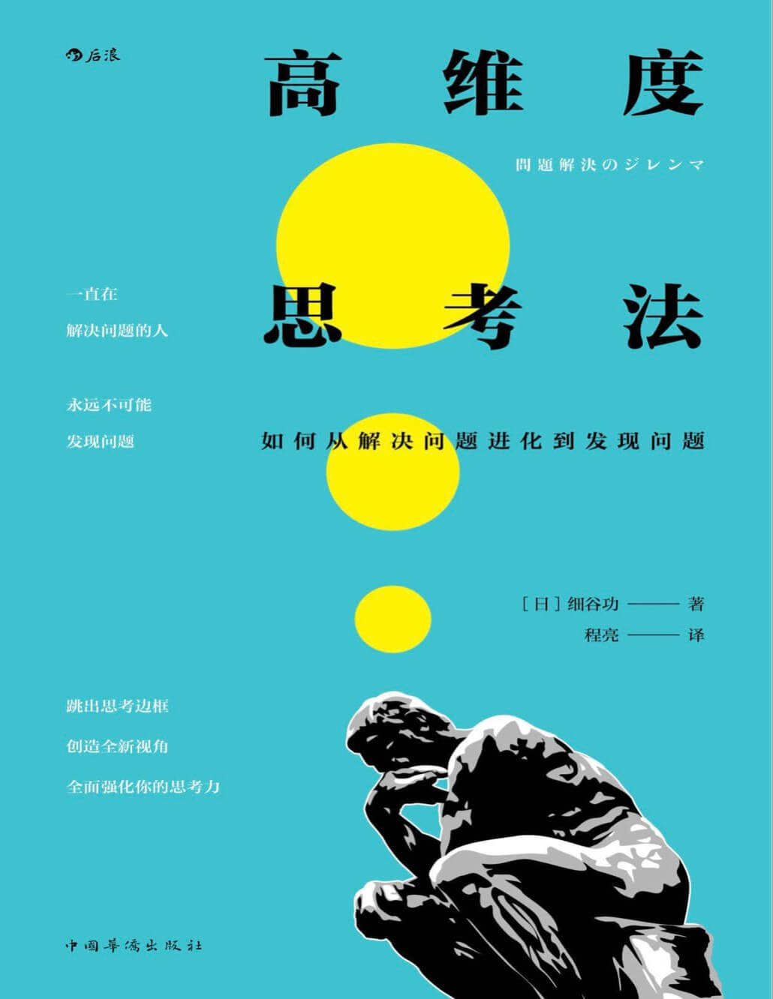
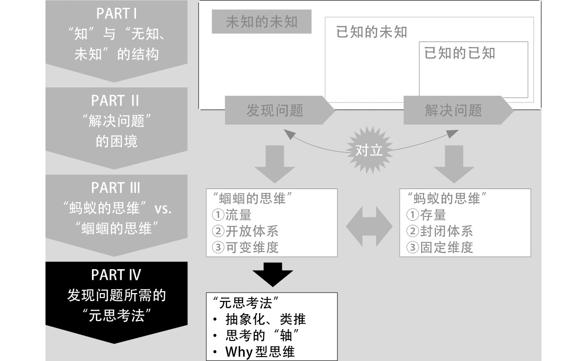

#### 概述
###### 书籍简介
<table>
    <tr>
        <td></td>
        <td>高纬度思考法：如何从解决问题进化到发现问题</td>
    </tr>
</table>

作者简介：
细谷功，商务顾问。毕业于东京大学工学部。初任职于东芝，后进入安永咨询公司（Ernst&Young Consulting，QUNIE 前身），负责产品开发等领域的战略制定及业务改革计划的制订、执行和定义。现任QUNIE 顾问研究员，另于企业和大学开展思维能力相关的研修和业务。

书本结构：

    

#### 第一部分：知、无知、未知及其结构

1.1 “未知的未知”这一死角
认识到知的三个层次，即：已知的已知、已知的未知、未知的未知。尤其是要意识到未知的未知这一层。

1.2 “知”是“事实和解释的组合”
  + 事实和解释的关系：事实只有一个，解释因人而异

    

1.3 “无知、未知”的思考框架

1.4 已知和未知的不可逆循环

1.5 苏格拉底和德鲁克所提倡的"无知"的两种视角

#### 第二部分：解决问题的困境：能解决问题的人，不能发现问题
2.1 “知”的困境
2.2 封闭体系的困境
2.3 “解决问题”的困境

#### 第三部分：从解决问题到发现问题
3.1 蚂蚁思维与蝈蝈思维的差异

蝈蝈：发现问题型思维
蚂蚁：解决问题型思维

| 蝈蝈的思维 | 蚂蚁的思维 |
|-------|-------|
| 流量    | 存量    |
| 开放体系  | 封闭体系  |
| 可变维度  | 固定维度  |

什么是蝈蝈和蚂蚁的流量与存量：蚂蚁储存食物、蝈蝈不储存食物
什么是开放和封闭体系：有巢和无巢
什么是可变维度和固定维度：蚂蚁平面移动，蝈蝈会跳跃

3.2 从存量到流量
+ 在变化少的环境下，存量思维是有益的
+ 在变化激烈的世界里，流量思维更具价值

+ 蚂蚁是有产者，重视守护自己的产业、口碑和名声
+ 蝈蝈是无产者，没有什么可守护的，更具开放性
3.3 从封闭体系到开放体系
+ 蚂蚁以巢为中心活动、蝈蝈无巢活动。
+ 封闭体系以主观为中心进行思考，开放体系则拥有客观看待自身的视角。

3.4 从固定思维到可变思维

3.5 从“奇点”出发的问题发现法

3.6 蚂蚁和蝈蝈能否共存共荣：两种思维在同一个人中、两种思维在不同人之间的相处中，的作用、分配、影响。
+ 各领域的蚂蚁和蝈蝈：这里借用数学领域简单阐述
+ 在“二维”中，蚂蚁常占据压倒性的优势：
  假如只用手攻击的拳击选手和手脚并用的自由搏击选手“公平地同台”较量，自由搏击选手就不能用脚。在这种情况下不难推测，始终只用手攻击的拳击选手比手脚并用的自由搏击选手更占优势。
+ 蝈蝈在蚂蚁窝里跳不起来：
+ 互相怎么看
+ 通过“元级”克服对立结构
+ 决定是蚂蚁还是蝈蝈的性格和环境

#### 第四部分：发现问题的元思考法，升维发现问题

    

4.1 上位概念&下位概念

理解：“上位”是一种思考抽象度的提升。作者说“上位概念是指用以思考的解释层”，这句话应该这么理解：我们观察到现象A/B/C，这三个现象有一些共性，那么我们提炼这些共性，再去思考现象ABC，就是一种思维提升，站在上位的概念思考问题。

4.2 通过“抽象化、类推”升维
> 若将个别事实视作具体，则基于某共同点抛弃其他所有特征、视 为“同一范畴内”的解释，就是抽象。顾名思义，抽象意味着“提取特征”。
> 科学的进化一言以蔽之，就是找到各个特殊事象间的共同点，得出定律，再将其适用 于各种各样的事象。各类科学技术的进步，都基本上均遵循这一原则。

4.3 通过思考的“轴”升维
书本定义：“观察个别事象（即下位概念）时，作为基准的上位概念的视角”
4.4 通过“Why”升维
4.5 为了活用“元思考法”

#### 总结
1、知的三个层次：已知的已知、已知的未知、未知的未知
2、蚂蚁和蝈蝈两种动物类比两种思维方式：解决问题思维vs发现问题思维
3、在组织管理中，如何使蚂蚁思维和蝈蝈思维的人都能发挥自己的才能。
4、三种升维方式：抽象化类推、思考轴、Why

本书借用两个动物的生活习性，类比两种思维方式。全书被划分成四个部分，重点是第四部分的三种升维方式，可以帮助我们提升思考的维度。粗读一遍总体感觉没有特别大的收获。
创造了一些“上位”，“下位”等专有名词的概念，反而让读者觉得神秘高大上，其实没什么新意，增加了理解难度，不知道是不是翻译的不好导致的。
总体推荐阅读指数3.5星。

