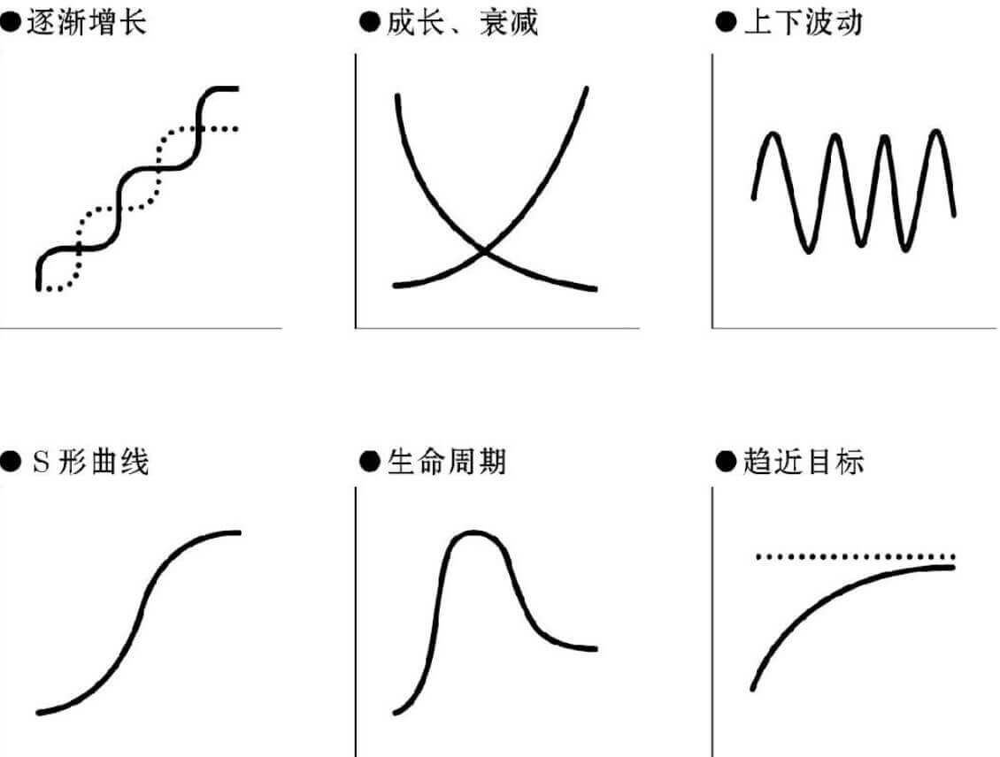

----------

#### 概述
###### 书籍简介
<table>
    <tr>
        <td></td>
        <td>麻省理工深度思考法 : 从模型及动力机制来思考现象</td>
    </tr>
</table>

###### 关于作者
\[日\] 平井孝志（Takashi Hirai）,罗兰贝格管理咨询公司执行董事,东京大学理学硕士、麻省理工MBA博士。

其他出版物：
- 《本質思考 : MIT菁英這樣找到問題根源，解決困境》、
- 《图像思考术 : 为什么聪明人会通过画图来思考？如何用一页纸解决生活和工作问题》

#### 书本的结构
1. 九个思维定式（了解思维定式才能注意📢避免）
2. 模型和动力机制
3. 第一步：建立模型
4. 第二步：解读动力机制
5. 第三步：寻找改变模型的对策
6. 第四步：从实践获得反馈
7. 日常训练方法

##### 九个思维定式

- 初级思维定式
  - 因果倒置——————（表面现象不是原因，究其现象的本质）
  - 满足于普通解
- 可能陷入两难的严峻定式
  - 依赖框架——————（框架是工具，不满足于工具的使用，而是借助框架思考）
  - 范围适应——————（指着眼于事物分类以寻找解释）
  - 思考止于关键词——————（要理解和思考一些高大上的关键词的含义，别以为你懂了）
  - 执着于初步假设
- 不能迈入思考大门的症状
  - 忘却思考的初衷——————（收集资料是为了使用资料，而不是目的）
  - 偏重过程
  - 失去独立思维——————（依赖他人，一味地"是啊"，"对啊"，"是这样吗？"）

##### 模型和动力机制

>“本质” = “模型” × “动力机制”

>“模型是指产生某种现象的结构，包括构成要素及其相互关系。”

>“所谓动力机制，是以长远目光观察模型产生的现象，以及今后将会产生怎样的结果及动向，即会出现怎样的模式。”

    

模型是什么？
- 剥离细枝末节后的精简概念图或因果循环图

动力机制是什么？
- 模型随着时间流逝产生的运动及结果

##### 建立模型

- 分析问题的因素，及其因果关系
- 用一张图绘制出因果循环图

    

建模要点①：5个要素：
- "输入源是指投入模型中的要素"
- "输出点是指模型产生的成果"
- “竞争关系是指在输入及输出等方面互相竞争的对象”
- “合作关系是指在一起可以互补或协作的对象”
- “影响者是指间接对模型整体产生重大影响的要素”

建模要点②：层次结构

    

建模要点③：注重因果，无视相关

    

##### 解读动力机制

“动力机制的 6 种代表性模式”

    

- 动力机制探究要点①：分开研究存量和流量
- 动力机制探究要点②：对事物进行非线性解读
- 动力机制探究要点③：探究作用与反作用
- 动力机制探究要点④：从各要素的视角进行深层次的思考

- 动力机制的解读方法①　探究拐点
- 动力机制的解读方法②　研究相变（相变使动力机制不再连续）
- 动力机制的解读方法③　锁定本源动力

##### 寻找改变模型的对策(寻找解决问题的根本方法)

- 寻找对策的要点① 正确理解前提条件
- 寻找对策的要点② 原因不一定接近结果
- 寻找对策的要点③ 将思考范围扩展到受影响的方方面面（不断地问自己是否考虑到了所有可能有影响的因素）
- 寻找对策的要点④ 提升视角
  - 尝试偶尔放下眼前的问题（如果被眼前的问题占用太多注意力，就很难摸索出问题的整体脉络）
- 寻找对策的要点⑤ 想一想“该如何思考”
  - “首先思考的应该是思考顺序和判断标准”

##### 从实践获得反馈
从实践中得到的反馈可以提高思考精确度，反复练习建立模型、解读动力机制、寻找改变模型的对策。

##### 日常训练方法
略。

#### 总结
- 全书的核心在第四第五章。其他部分可以快速跳读。
- 全书围绕1.建立模型、2.解读动力机制、3.改变模型，这三个步骤介绍了当我们遇到各种问题时，我们应该如何分析问题，找出问题的本质，然后从本质解决问题本身，而不是浮于表面。同时，脑海中要牢记一些思维定式，避免陷入思维定式当中。